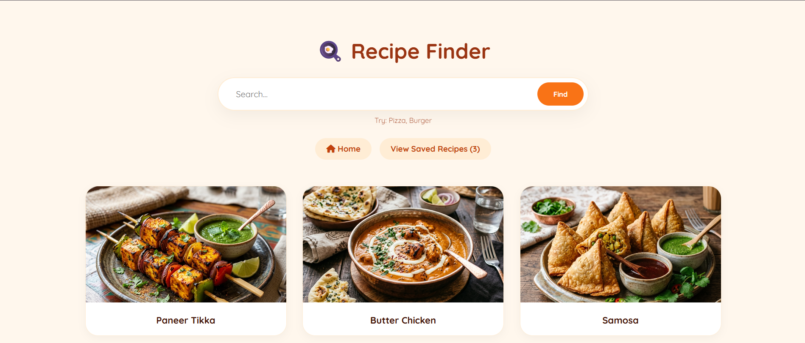
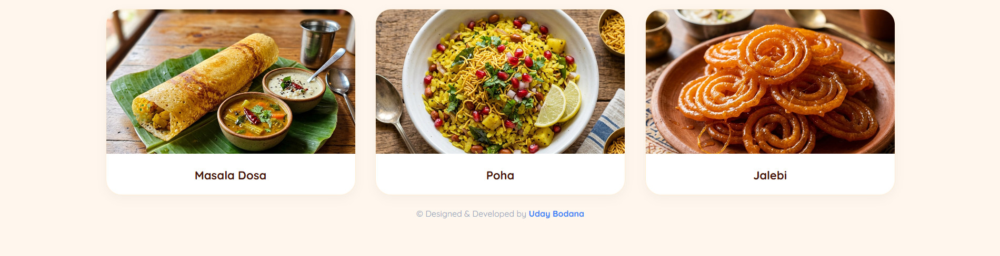
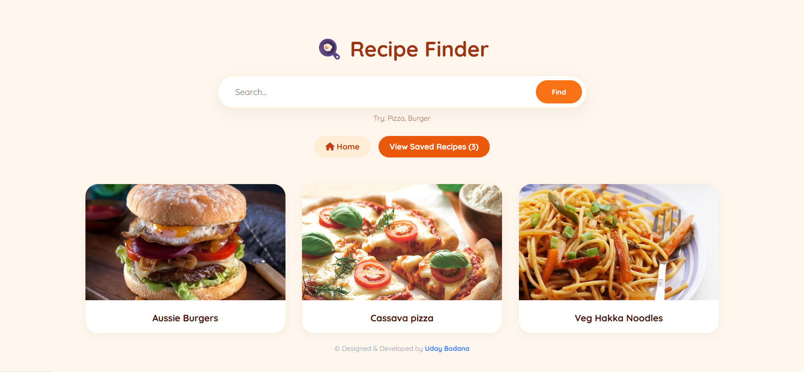

# 🍳 Recipe Finder

A sleek and comprehensive recipe exploration platform. Discover dishes via hybrid real-time API searching, view exact ingredient metrics and step-by-step cooking instructions, and maintain your personal favorites list.

---

## ✨ Features

- **Hybrid Multi-Source Search:** Leverages Spoonacular API (using developer configuration key) and automatically falls back to TheMealDB API, expanding the query database.
- **Local Indian Recipe Database:** Includes a built-in, offline-capable database of popular Indian recipes (Paneer Tikka, Butter Chicken, Samosa, Masala Dosa, Poha, and Jalebi) complete with high-quality local assets.
- **Detailed Culinary Modal:** Click on any recipe card to view an overlay highlighting step-by-step instructions and exact ingredient measures.
- **Favorites Management:** Securely bookmark preferred recipes directly to your personal list using `localStorage`.
- **Premium Food Theme:** Sleek dark-themed aesthetics with vivid food highlight colors, elegant gradients, and smooth hover effects.

---

## 🚀 How to Use

1. **Search Culinary Delights:** Enter a dish name or ingredient into the clean search bar to query live recipes.
2. **View Complete Instructions:** Click the detailed instructions button to trigger the modal containing steps and ingredients.
3. **Save Your Favorites:** Hit the favorite icon to bookmark dishes instantly.

---

## 💻 Tech Stack

- **HTML5**
- **CSS3**
- **JavaScript (Fetch API, Async Data Handling, and DOM Iteration)**

---

## 🏃 How to Run

1. Clone or download this repository.
2. Open `index.html` directly in any web browser, or use a local development server like **Live Server** in VS Code.

---

## 📸 Preview

---

© Designed & Developed by **Uday Bodana**